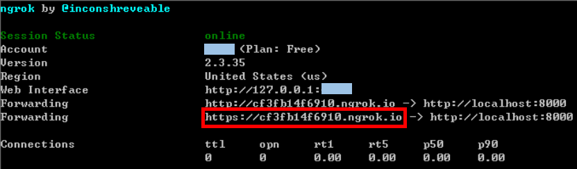
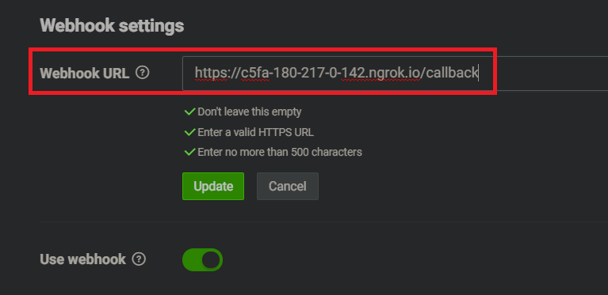

# CLICK

## 資料夾階層

```
├───Hardware
|   ├───SerialListener
│   └───Click Patch
|
└───lineBot_Server
```

-   Hardware Click 貼片硬體控制相關程式

    -   Click_Patch
    -   SerialListener

-   lineBot_Server lineBot 聊天機器人之處理伺服器
    -   Ngrok
    -   app.py
    -   config.ini

## 啟動 LineBot Server

1. 執行 `server-start.bat`，以 Flask 架設伺服器
2. 執行 `server-deploy.bat`，以 Ngrok 將內網與外網串接起來
   
3. 進入 [line Developers](https://developers.line.biz/en/) 網站，將 webhook URL 更新為當前串接之外網網址 (上一部獲得之網址)
   
4. lineBot Server 建設完成
