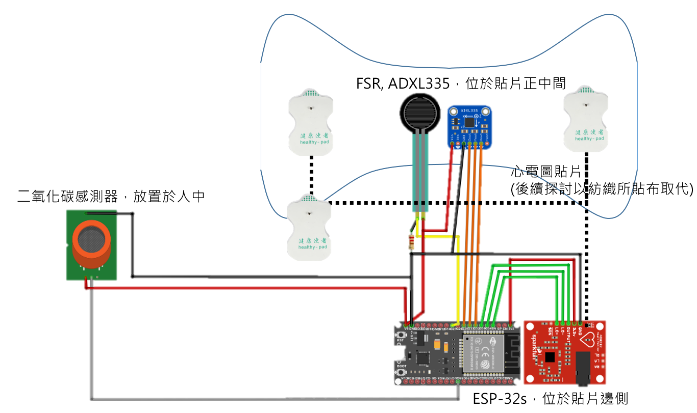

# CLICK

## 資料夾階層

```
├───Click-Hardware
|   ├───SerialListener
│   └───Click Patch
```

-   Hardware Click 貼片硬體控制相關程式

    -   Click_Patch
    -   SerialListener

<h1 id="click_patch">Click_Patch</h1>

Click ESP32 開發版的韌體程式，

-   開發環境： PlatformIO
-   語法：Arduino

<h2 id="circuit_design">電路設計</h2>



---

<h1 id="serialListener">SerialListener</h1>

資訊處理部分，未來應移植到韌體上
現在以 Processing Java 語系 進行圖像化處理

-   開發環境： Processing 3.5.4
-   語法：Java

負責分析 ADXL335 傳回之 加速度波，嘗試進行二次積分獲得位移變化
